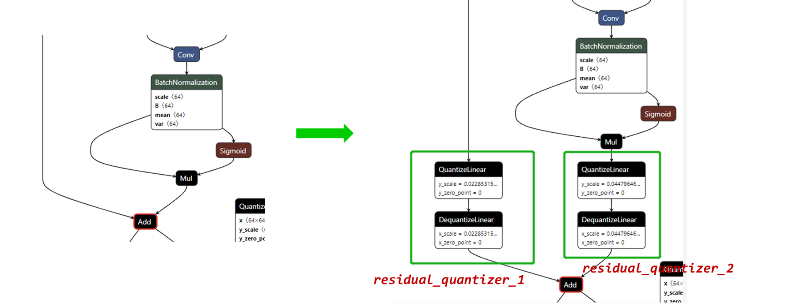
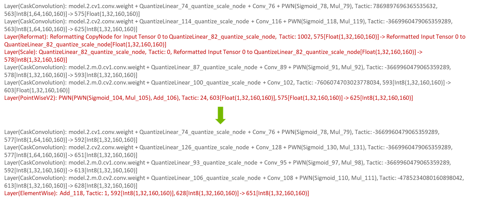

# yolov5_quant_sample

## Introduction

This is 8-bit quantization sample for yolov5.
Both PTQ, QAT and partial quantization have been implemented, and present the accuracy results based on yolov5s.


| Method | Description |
| ------ | ------ |
| **PTQ** | TensorRT's native PTQ |
| **QAT** | TensorRT's quantization toolkit for PyTorch  |
| **Partial Quantization** | Leave some quant-sensitive layers in higher precision (fp32/fp16) to improve accuracy   |


## Notes
**This repo is based on the release version(v5.0) of [yolov5](https://github.com/ultralytics/yolov5/).**

## Code Structure 
Focus on the modifications and additions based on the release version(v5.0) of yolov5.
```
├───trt                              # Directory for TensorRT's engine build(including PTQ scripts), evaluation and visualization.
│   ├───calibrator.py                # TensorRT native PTQ's calibrator
│   ├───demo.py                      # Run the inference on a picture, and save the visualization result.
│   ├───eval_yolo_trt.py             # Evaluate the tensorRT engine's accuary.
│   ├───onnx_to_trt.py               # Script for building TensorRT's engine.
│   ├───onnx_to_trt_partialquant.py  # Script for building TensorRT's engine with partial quantization.
│   ├───Processor.py                 # Base class for engine runtime.
│   └───Visualizer.py                # Visualize the detection result.   
├───utils_quant                      # Auxiliary scripts for PTQ and QAT.
│   ├───calib_test.sh                # The simple way to search for the best calibration params.
│   ├───check_params.py              # Check the validity of parameters for QAT. 
│   ├───onnxrt_demo.py               # Run the onnx model, generate the results, just for debugging
│   └───print_model_structure.py     # Print the model structure and param, just for debugging               
├───test.py                          # Evaluation            
├───train.py                         # Traning
└───yolo_quant_flow.py               # The main script for QAT expriment.
```


## Results of Quantization

**Please refer to [yolov5s_Reduced Precision Practice](https://drive.google.com/file/d/19DjEk31PzWMKJrEpfhKBUjfSMR9pwnne/view?usp=sharing) for detail.**

Method |Calibrator |mAP<sup>val<br>0.5:0.95 |mAP<sup>val<br>0.5 |
---   |---  |---        |---         |
PyTorch native fp32    |  |0.367     |0.558     |
TensorRT engine fp32    |  |**0.365**    |**0.556**     |
TensorRT's native PTQ    |IInt8MinMaxCalibrator  |0.350 |0.542 |
TensorRT's native PTQ<br>with Partial Quantization    |IInt8MinMaxCalibrator  |**0.363** |**0.555** |
| | | |
Insert FakeQuant nodes &<br>Disable 4 quant-sensitive layers    |IInt8MinMaxCalibrator |0.359     |0.551     |
QAT finetuning 20 epochs &<br>Disable 4 quant-sensitive layers  |IInt8MinMaxCalibrator |**0.363**     |**0.556**     |

## Setup  
### 1. Clone the Sample  
```
git clone https://gitlab-master.nvidia.com/weihuaz/yolov5_quant_sample.git
```  

### 2. Dataset Preparation
Download the labels and images of coco2017, and unzip to the same level directory as the current project. Please refer to [Yolov5 coco2017 Preparation](https://www.freesion.com/article/15911342560/) for reference.
```
.
├── coco                              # Directory for datasets 
│   ├── annotations
│   │   └── instances_val2017.json
│   ├── images
│   │   ├── train2017
│   │   └── val2017
│   ├── labels
│   │   ├── train2017
│   │   └── val2017
│   ├── train2017.txt
│   └── val2017.txt
└── yolov5_quant_sample               # Quantization source code 
```
```
wget https://github.com/ultralytics/yolov5/releases/download/v1.0/coco2017labels.zip         # Download the labels needed
wget http://images.cocodataset.org/zips/train2017.zip
wget http://images.cocodataset.org/zips/val2017.zip
wget http://images.cocodataset.org/annotations/annotations_trainval2017.zip
```  

### 3. Docker Build and Launch
It is recommended to use Dockerfile and the scripts under the docker folder(Run these commands under `yolov5_quant_sample` path).
1. With the command `bash docker/build.sh`, you can build the docker.
2. With the command `bash docker/launch.sh`, you can launch the docker. By default, docker launches with GPU:0. Change according to your needs.

Tips:  
1. If the format error occurs, such as "$'\r': command not found", please use dos2unix to convert.    
2. If the torch version is not compatible with the cuda driver, try to install another version, for example:    
```bash
$ pip install --no-cache torch==1.9.1+cu111 torchvision==0.10.1+cu111 -f https://download.pytorch.org/whl/torch_stable.html
```  

### 4. Download Yolov5s Pretrained Model  
```bash
$ cd weights
$ wget https://github.com/ultralytics/yolov5/releases/download/v5.0/yolov5s.pt
$ cd ..
```  

## Experiments  
`quant_test.ipynb` is a good reference for test. 

### PTQ

1.  `export.py` exports a pytorch model to onnx format.
    ```bash
    $ python models/export.py --weights ./weights/yolov5s.pt --img 640 --batch 1 --device 0
    ```

2.  `onnx_to_trt.py` aims to build a TensorRT engine from a onnx model file, and save to the `weights` folder.
    You can specify to build different precisions(fp32/fp16/int8).  
    Notes: If you change the setting of the int8 calibrator, please delete the trt\yolov5s_calibration.cache. Otherwise, the change may not take effect. 
    The setting of calibrator the batchsize for calibration, the number of calibration batch, the type of calibrator.  
    ```bash
    $ rm trt/yolov5s_calibration.cache
    ```
    
    - Example 1: Build a int8 engine using TensorRT's native PTQ. 
    ```bash
    $ python trt/onnx_to_trt.py --model ./weights/yolov5s.onnx --dtype int8 --batch-size 32 --num-calib-batch 16
    ```

    - Example 2: Build a fp32 engine. 
    ```bash
    $ python trt/onnx_to_trt.py --model ./weights/yolov5s.onnx --dtype fp32
    ```

3.  Evaluate the accurary of TensorRT inference result.  
   Note: The TensorRT engine name should be modified according to the output of the previous step.    
    ```bash
    $ python trt/eval_yolo_trt.py --model ./weights/yolov5s.trt -l
    ```

### PTQ with Partial Quantization
`trt/onnx_to_trt_partialquant.py` aims to build a TensorRT engine with partial quantization.  

1. Get the onnx model with `export.py`.  
    ```bash
    $ python models/export.py --weights ./weights/yolov5s.pt --img 640 --batch 1 --device 0
    ```

2. Simplify the onnx model and delete useless layers or nodes. 
    ```bash
    $ python -m onnxsim ./weights/yolov5s.onnx ./weights/yolov5s-simple.onnx
    ```

3. Choose the sensitive layers. Need some manual operation, please refer to the code.   
    a) Print all the layers ids;   
    b) Combine the onnx model structure to choose the sensitive layers  
    ```bash
    $ python trt/onnx_to_trt_partialquant.py --model ./weights/yolov5s-simple.onnx --dtype int8 --batch-size 32 --num-calib-batch 16
    ```

4. Evaluate the accurary of TensorRT inference result.  
   Note: The TensorRT engine name should be modified according to the output of the previous step.    
    ```bash
    $ python trt/eval_yolo_trt.py --model ./weights/yolov5s-simple.trt -l
    ```

### Sensitivity Profile
`yolo_quant_flow.py` is the main script for QAT experiment.  
And you can do sensitivity profile by specify the flag `--sensitivity`, then build_sensitivity_profile() will be called.
It takes a long time to complete the entire analysis, please be patient. 

  

    ```bash
    $ python yolo_quant_flow.py --data data/coco.yaml --cfg models/yolov5s.yaml --ckpt-path weights/yolov5s.pt --hyp data/hyp.qat.yaml --sensitivity
    ```

### Skip Sensitive Layers
`yolo_quant_flow.py` is the main script for QAT experiment.  
Add the param `--skip-layers`, then skip_sensitive_layers() will be called.  We will skip 4 quant-sensitive layers based on the sensitivity profile.


### QAT Finetuning
`yolo_quant_flow.py` is the main script for QAT experiment. See the code comments for details.   
Run the script as below. The QDQ insert, calibration, QAT-finetuning and evalution will be performed.  
QAT-Finetuning takes long time, you can skip this step and download the [post-QAT model](https://drive.google.com/file/d/1Q1u81E0yLVrwHgazTN-l38ZyEFL78ggz/view?usp=sharing) directly.     
```
    QAT-finetuning
    $ python yolo_quant_flow.py --data data/coco.yaml --cfg models/yolov5s.yaml --ckpt-path weights/yolov5s.pt --hyp data/hyp.qat.yaml --skip-layers
    
    Build TensorRT engine
    $ python trt/onnx_to_trt.py --model ./weights/yolov5s-qat.onnx --dtype int8 --qat
    
    Evaluate the accuray of TensorRT engine
    $ python trt/eval_yolo_trt.py --model ./weights/yolov5s-qat.trt -l
```    
    
If you have a QAT-finetuning Pytorch checkpoint, you can export to onnx using the command below.  
```
    Export to onnx
    $ python models/export_qat.py --weights ./weights/yolov5s-qat.pt --img 640 --batch 1 --device 0 
```
    
### Dynamic Shape Support  
We can export the model with dynamic shape, specify some or all tensor dimensions until runtime. And the inference shape can be adjusted during the runtime.

1. Export to ONNX with dynamic shape support(with `--dynamic`)   
    ```bash
    QAT model 
    $ python models/export_qat.py --weights ./weights/yolov5s-qat.pt --img 640 --dynamic --device 0
   
    Common models(take fp16 as a example)
    $ python models/export.py --weights ./weights/yolov5s.pt --img 640 --dynamic --device 0  
    ``` 

2. Build the TensorRT engine with dynamic shape support 
     ```bash 
    QAT model
    $ python trt/onnx_to_trt.py --model ./weights/yolov5s-qat.onnx --dtype int8 --qat --dynamic-shape
   
    Common models(take fp16 as a example)
    $ python trt/onnx_to_trt.py --model ./weights/yolov5s.onnx --dtype fp16 --dynamic-shape   
    ``` 

3. Specify the inference shape and evaluate the engine  
   Note: The TensorRT engine name should be modified according to the output of the previous step.    
     ```bash 
    QAT model
    $ python trt/trt_dynamic/eval_yolo_trt_dynamic.py --model weights/yolov5s-qat.trt -l
   
    Common models(take fp16 as a example)
    $ python trt/trt_dynamic/eval_yolo_trt_dynamic.py --model weights/yolov5s.trt -l  
    ``` 

### Further Optimization (Improve QAT Throughput)    
Since the residual block is used in the backbone of yolov5s. TensorRT has extra runtime optimization about the residual add. In order to maximize the throughput of QAT, when inserting QDQ nodes, it's recommended to add extra quantizer to the `BasicBlock` and `Bottleneck`.  
Take the `Bottleneck` as a example(`models/common.py`). We can insert extra quantization/dequantization nodes as below.

```angular2
class Bottleneck(nn.Module):
    # Standard bottleneck
    def __init__(self, c1, c2, shortcut=True, g=1, e=0.5):  # ch_in, ch_out, shortcut, groups, expansion
        super(Bottleneck, self).__init__()
        c_ = int(c2 * e)  # hidden channels
        self.cv1 = Conv(c1, c_, 1, 1)
        self.cv2 = Conv(c_, c2, 3, 1, g=g)
        self.add = shortcut and c1 == c2

        # Added by maggie for QDQ debugging in order to improve throughput
        if self.add:
            self.residual_quantizer_1 = quant_nn.TensorQuantizer(quant_nn.QuantConv2d.default_quant_desc_input)
            self.residual_quantizer_2 = quant_nn.TensorQuantizer(quant_nn.QuantConv2d.default_quant_desc_input)

    def forward(self, x):
        #return x + self.cv2(self.cv1(x)) if self.add else self.cv2(self.cv1(x))

        try:
            if self.add:
                return self.residual_quantizer_1(x) + self.residual_quantizer_2(self.cv2(self.cv1(x)))
            else:
                return self.cv2(self.cv1(x))
        except AttributeError as e:
            # Compatible with PTQ path, handle models without extra residual_quantizer
            # print('\'Bottleneck\' object has no attribute \'residual_quantizer_1\'')
            return x + self.cv2(self.cv1(x)) if self.add else self.cv2(self.cv1(x))

```

Please refer to [TensorRT OSS/tool/pytorch-quantization/Further optimization](https://github.com/NVIDIA/TensorRT/blob/master/tools/pytorch-quantization/docs/source/tutorials/quant_resnet50.rst#further-optimization) for detail. And it is highly recommended to walk through the [Q/DQ Layer-Placement Recommendations](https://docs.nvidia.com/deeplearning/tensorrt/developer-guide/index.html#qdq-placement-recs) part of `TensorRT Developer Guide` before you start.    
During the optimization, the following commands are needed. You can compare the results before and after the extra QDQ insertion. 

```bash
Insert QAT, do calibration and export to onnx file
$ python yolo_quant_flow.py --data data/coco.yaml --cfg models/yolov5s.yaml --ckpt-path weights/yolov5s.pt --hyp data/hyp.qat.yaml --num-finetune-epochs=0 --skip-eval-accuracy

Rename the onnx file
$ mv weights/yolov5s.onnx ./weights/yolov5s_with_residual_quant.onnx

Export to TensorRT engine
$ python trt/onnx_to_trt.py --model ./weights/yolov5s_with_residual_quant.onnx --dtype int8 --qat --verbose

Test the throughput with trtexec
$ trtexec --loadEngine=./weights/yolov5s_with_residual_quant.trt 
```
 
Check the onnx file with Netron, you will see the extra QDQ nodes as below. Then we can test the throughput with `trtexec`.



From the engine layer information, we can see some additional `Reformat` and `Scale` operations have gone.  



# Notes  
During the practices, there are some common bugs around new features(such as QAT, mixed precision). If you encouter any issues, please leave a message.
